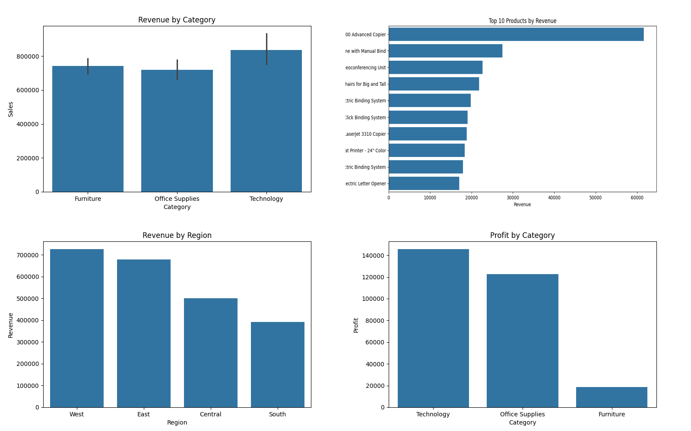
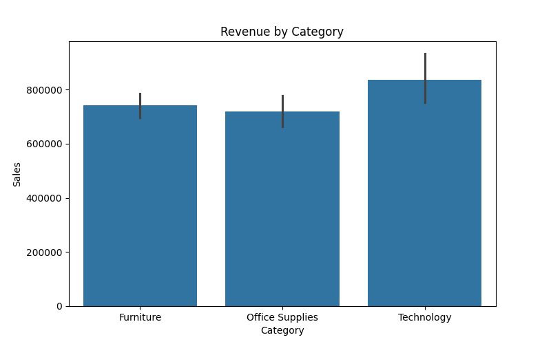
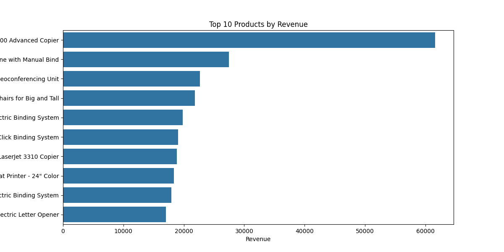
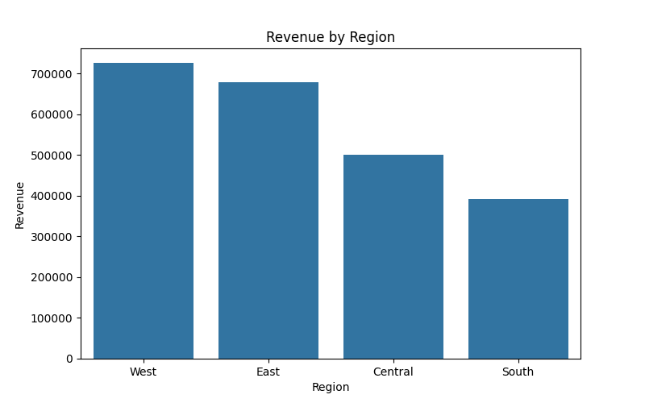
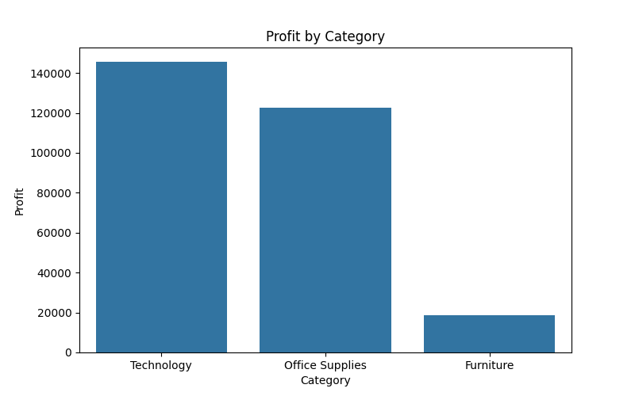

# Retail Sales SQL Analysis

## Project Overview

This project analyzes the Superstore retail dataset using Python, Pandas, SQLite, Matplotlib, and Seaborn.

The goal was to uncover business insights related to sales performance, profitability, customer behavior, product performance, and regional trends through Exploratory Data Analysis (EDA) and SQL queries.

---

## Dashboard Summary



---

## Technologies Used

- Python
- Pandas
- NumPy
- Matplotlib
- Seaborn
- SQLite3
- Jupyter Notebook
- Git & GitHub

---

## Dataset

The Sample Superstore dataset contains retail sales transactions including:

- Orders
- Customers
- Products
- Categories
- Regions
- Sales
- Profit
- Discounts
- Shipping Information

---

## Project Structure

```text
retail-sales-sql-analysis/
│
├── data/
│   └── Sample - Superstore.csv
│
├── image/
│   ├── dashboard_summary.png
│   ├── revenuebycategory.png
│   ├── regional.png
│   ├── top10.png
│   └── profitanalysis.png
│
├── notebook/
│   └── Retail_Sales_Analysis.ipynb
│
├── scripts/
│   ├── load_to_sqlite.py
│   ├── test_sql.py
│   └── sql_analysis.py
│
├── sql/
│   ├── superstore.db
│   └── sales_analysis.sql
│
└── README.md
```

---

# Exploratory Data Analysis (EDA)

## Revenue by Category



### Insights

- Technology generated the highest revenue.
- Furniture ranked second in total sales.
- Office Supplies contributed consistent revenue across orders.

---

## Top Products Analysis



### Insights

- Canon imageCLASS 2200 Advanced Copier generated the highest revenue.
- A small number of premium products contributed a significant share of total sales.
- High-ticket products heavily influence overall revenue.

---

## Regional Sales Analysis



### Insights

- Regional performance varied significantly across the business.
- Some regions generated strong sales and profits simultaneously.
- Regional analysis can support expansion and marketing decisions.

---

## Profit Analysis



### Insights

- Technology was the most profitable category.
- Several products generated losses despite strong sales.
- Profitability analysis helps identify products requiring pricing or discount adjustments.

---

# SQL Analysis

The dataset was loaded into SQLite and analyzed using SQL queries.

### Queries Performed

- Top 10 Products by Revenue
- Highest Profit Category
- Monthly Sales Trends
- Customer Segmentation
- Regional Performance
- Most Profitable Products
- Loss Making Products

---

## Key Metrics

| Metric | Value |
|----------|----------:|
| Total Revenue | $2,297,200.86 |
| Total Profit | $286,397.02 |
| Total Orders | 5,009 |
| Total Customers | 793 |

---

## Key Findings

- Technology generated the highest revenue among all categories.
- Canon imageCLASS 2200 Advanced Copier was the top revenue-generating product.
- Revenue exceeded $2.29M across all transactions.
- Total profit exceeded $286K.
- Several products produced negative profits despite generating revenue.
- Customer spending was concentrated among a small group of high-value customers.
- Regional performance revealed differences in both sales and profitability.

---

## Business Recommendations

- Increase focus on Technology products due to strong revenue and profitability.
- Review pricing and discount strategies for loss-making products.
- Target high-value customers through loyalty and retention programs.
- Allocate marketing resources toward high-performing regions.
- Use monthly sales trends for inventory and demand planning.

---

## Author

**Arya Pawar**
